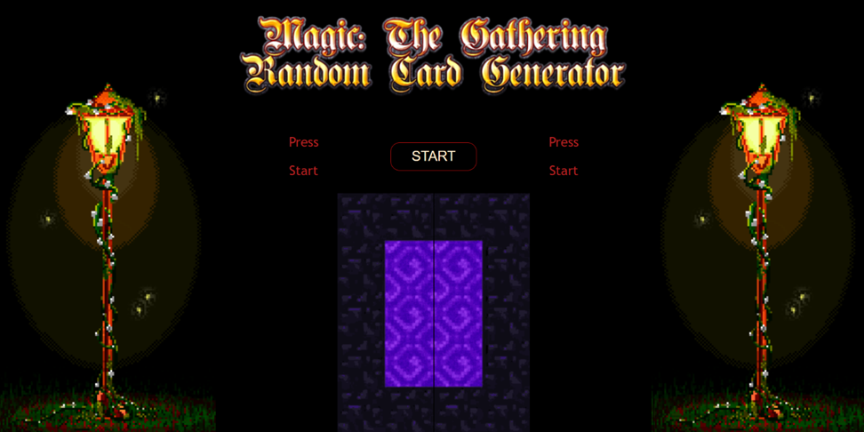
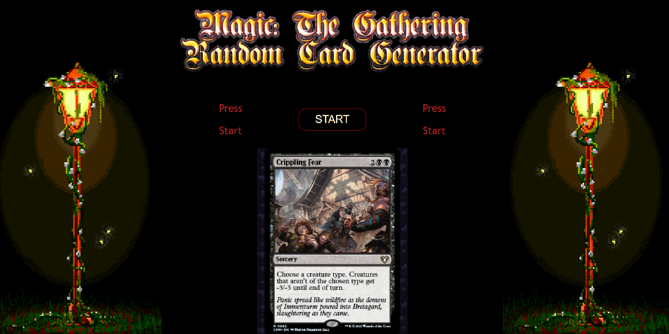

Project: SBA-308a

Date of Complication: 10/27/2024

Coder: Aaron Santiago (aSantia727)

Summary: This SBA called for the use of one API, of the coders choosing, to be called on and run within a single page. The page is to be themed around the API and at least two Export and Import should be used.
API: https://magicthegathering.io/
 	 	 
  

Opening Screen:

After Button Press:
 

With each time the button is pressed a random card within the API collection. The card is randomly called via fetch to https://api.magicthegathering.io/v1/cards?random=true&contains=imageUrl

Any continued activation of the “Start Button” will remove the current card and replace it with another random.

How to use:
Clone the repo via:

Git clone https://github.com/aSantia727/SBA-308a.git

Run:

Activate the code via the Live Server extension in VS-Code.
